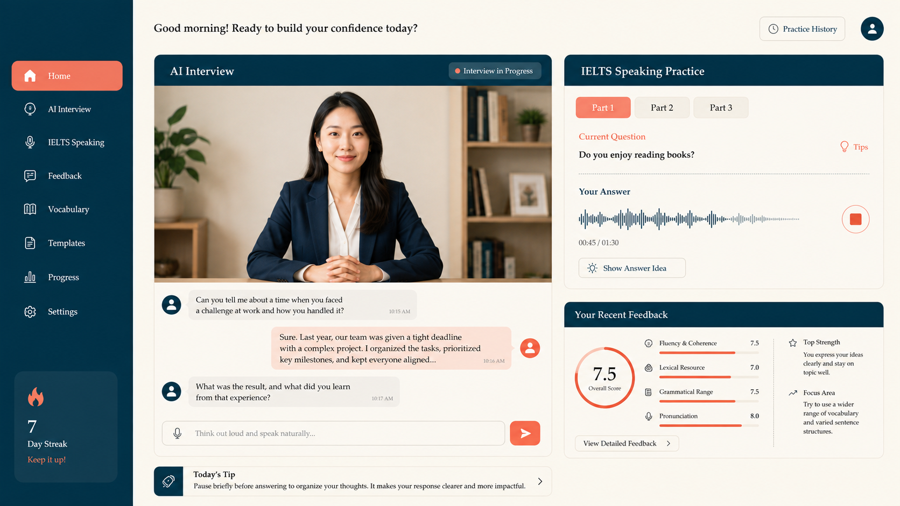
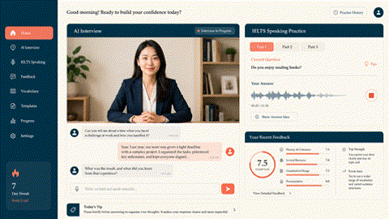
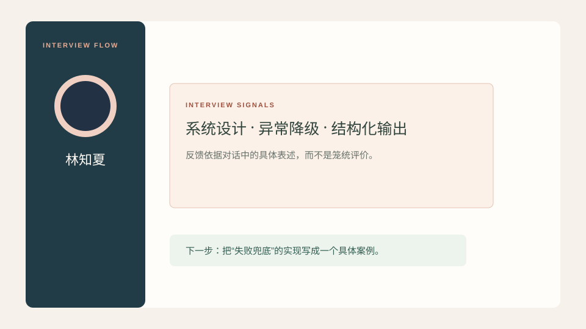
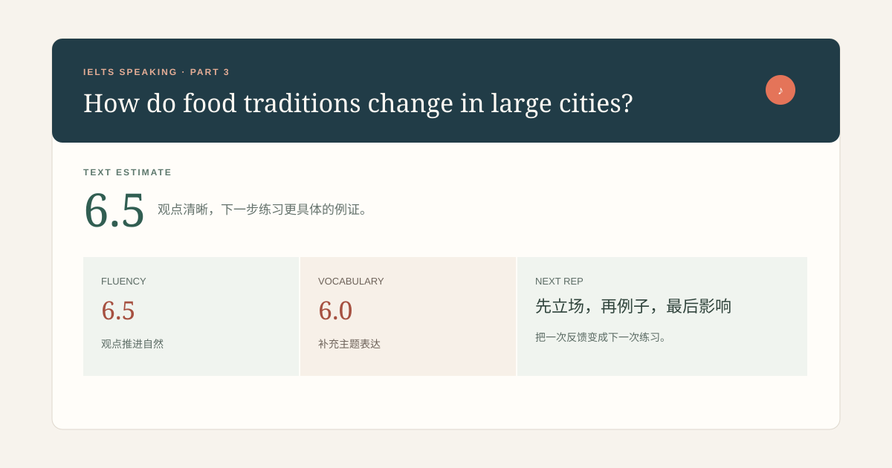

<p align="center">
  
</p>

<h1 align="center">Eloquy</h1>

<p align="center"><i>Practice with presence.</i></p>

<p align="center">面向技术面试与 IELTS 口语练习的对话式学习产品概念展示。</p>

<p align="center"><code>React</code> · <code>TypeScript</code> · <code>Vite</code> · <code>FastAPI</code> · <code>WebSocket</code> · <code>LLM evaluation</code> · <code>Cloud speech</code></p>

---

> **这是公开展示版。** 它使用静态 mock 数据呈现产品流程与交互思路；不包含用户简历、JD、音频、API 密钥、语音协议、生产题库或评分策略。

<p align="center">
  
</p>

## 从“回答问题”到“知道下一步怎么练”

Eloquy 不把练习做成单次问答，而是尝试将提问、表达、追问与复盘连接成一条可执行的反馈链路。公开版保留两个可以直接体验的交互流程：

| 场景 | 你可以看到什么 |
| --- | --- |
| **面试模拟** | 根据候选人经历逐步推进追问，在结束时呈现基于回答证据的复盘。 |
| **IELTS 口语** | 在 Part 1 / 2 / 3 间切换，观察考官状态、题型节奏与分项反馈。 |

## Product walkthrough

### 01 — Interview practice

<p align="center">
  
</p>



- 用逐轮推进替代一次性长问卷，让追问有明确的上下文。
- 林知夏是实际产品中使用的女性考官形象；展示图与真实前端共用同一素材。
- 将回答中的具体经历转化为可回看的亮点、缺口和下一步练习建议。
- 展示版只呈现前端流程；真实简历解析、模型编排与存储均保留在私有实现中。

### 02 — IELTS speaking practice



- 保留 Part 1、Part 2、Part 3 各自的练习节奏，而不是把它们当成同一种问答。
- 反馈强调可理解性与下一步行动；英文表达修改会在完整产品中按原句保留。
- 公开版中的题目、成绩与报告均为演示内容，并不代表真实测评结果。

## Public boundary / 开源边界

```text
Public showcase
├── interaction prototypes and mock data
├── visual system and responsive layouts
└── product-flow documentation

Private full product
├── session API and WebSocket gateway
├── LLM orchestration and evaluation prompts
├── speech recognition / synthesis integrations
└── user-scoped persistence and operational configuration
```

这样划分的目的不是隐藏产品思路，而是让公开仓库能够清楚说明设计与工程边界，同时避免暴露用户数据和第三方服务凭据。

## Run locally

```bash
npm install
npm run dev
```

打开终端提示的本地地址即可体验交互原型。此仓库不需要环境变量，也不会发起真实网络请求。

## Full version

希望体验包含实时语音、个性化追问与完整反馈闭环的版本？欢迎在本仓库提交 [Issue](../../issues) 联系我。
